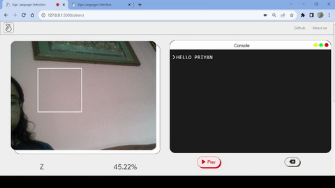
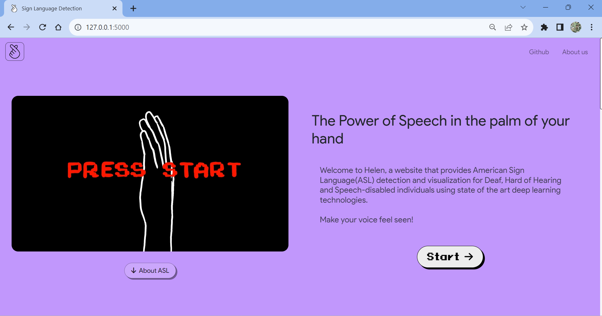
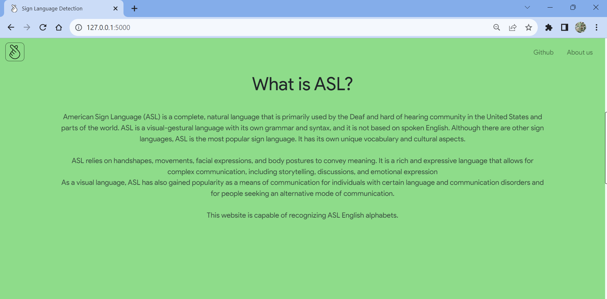
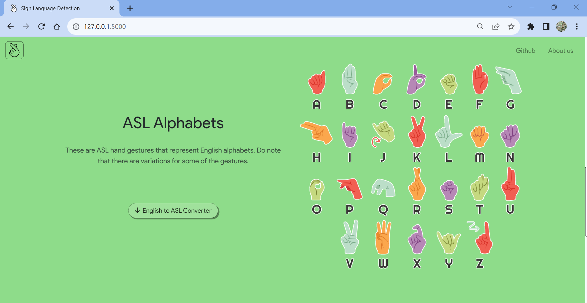
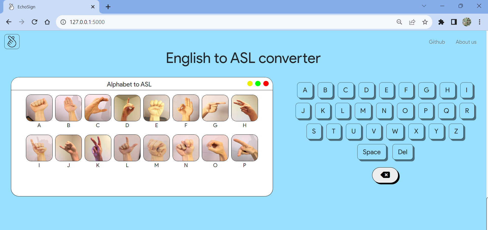
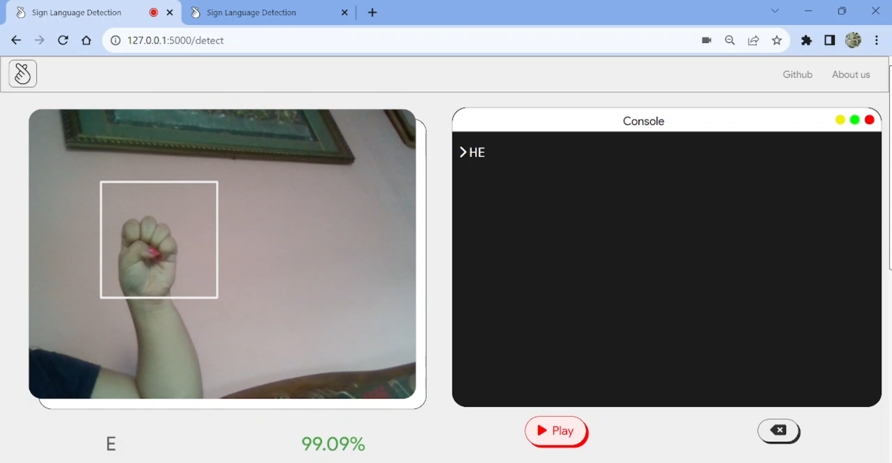
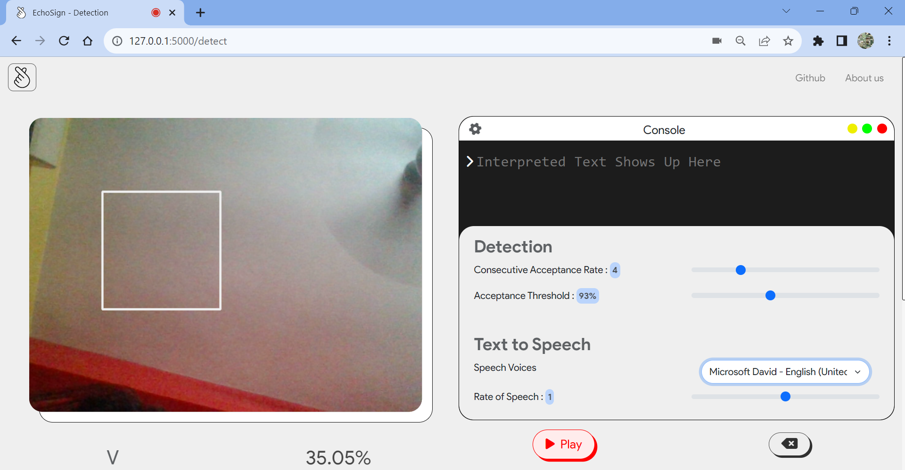
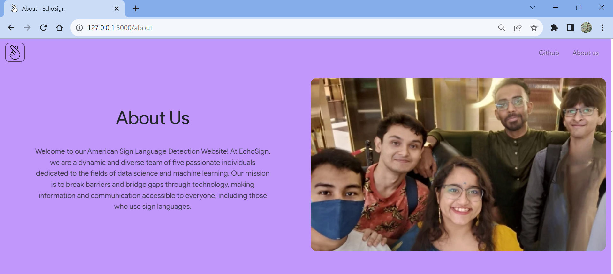
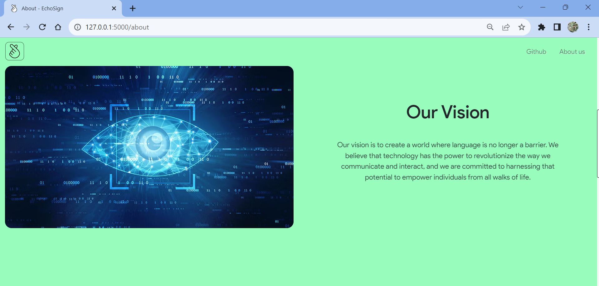
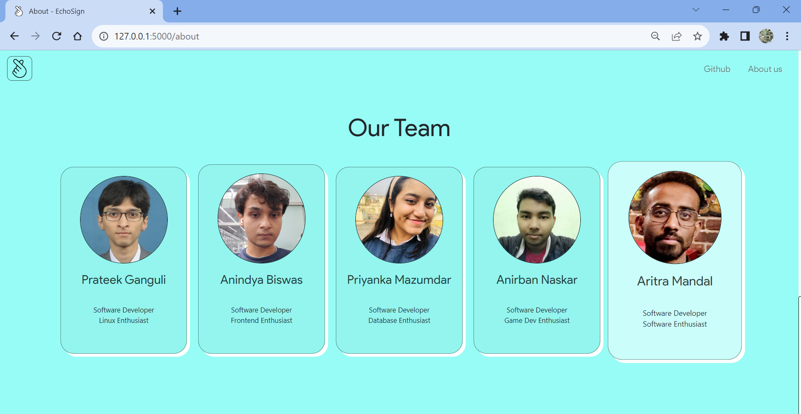

# Sign Language (ASL) Detection System using MobileNet, TensorFlow v2, Python, Flask, OpenCv2, Web Speech API

<!-- PROJECT LOGO -->
<br />
<div align="center">
    
    <h3 align="center">EchoSign</h3>
    
    <p>This gif shows ASL sign detetcion and recognition of the class which is written as interpreted text.<br>To hear the text-to-speech, navigate to <a href="https://github.com/priyanka-maz/sign-language-detection/tree/02d1380cf65be57c157e2614124518a20ca95989/screenshots">Live_ASL_detection_TTS.mp4</a></p>
</div>

## Setup using Python virtual environment

First we create the virtual environment and clone the repository into it. 
Then, we install all dependencies before running the application.
```sh
python3 -m venv /path/to/venv
cd /path/to/venv
git clone https://github.com/priyanka-maz sign-language-detection
source bin/activate
cd sign-language-detection
python3 -m pip install -r requirements.txt
python3 app.py
```

## Usage

- Click on 'Start' on the homepage to begin sign language detection on your video feed

- Permissions for video feed usage must be set to 'Allow'

- Write letters in American Sign Language to form words or phrases which show up on the console on the right

- Click on 'Play' button below the console to convert your sentences from text-to-speech for seamless communication

- For non-ASL users, you can refer to the English to ASL converter on the homepage 

- Follow instructions under console for further instructions

## Screenshots











## Features 

- This website was developed using Python, Flask, HTML, CSS & Javascript.
- Users who wish to converse in ASL, may use this detection system to convert the interpreted text to speech for communicating without bounds.
- Users who aren't equipped with ASL may use the English to ASL converter to learn relevant symbols.
- The voice for TTS technology may be changed in settings.
- Developers may check the raw footage opened using SocketIO and the prediction on top of that OpenCV feed.
- Text-to-speech translation uses ```SpeechSynthesisUtterance()``` of the Web Speech API.
- ```TensorFlow 2.0``` and ```Keras``` library is used in the development of our model. The final model used for testing and deployment is ```MobileNet```.
- Other machine learning techniques employed are:
    - Data Augmentation
    - Transfer Learning
    - Validation Set for Accuracy metric 
    - Early Stopping
    - Nadam Optimizer
    - Exponential Decay Learning Rate 
    - Categorical Cross Entropy Loss 

## File Structure

```
.
├── app.py.............................Runs the Flask application and deploys all webpages
│                                      as well as calls necessary computational functions
├── datasets...........................Contains tar.gz file of the dataset and 
│                                      some necessary statistics for the dataset
├── LICENSE............................MIT LICENSE
├── models.............................TFLITE version models of MobileNet and EfficientNet
│   ├── model_efficientnet_v2s.tflite
│   └── model_mobilenet_v2.tflite
├── README.md
├── requirements.txt
├── screenshots........................Contains necessary visualizations about the 
│                                      model performance, data and website
├── static.............................Contains all js, css files and images used in the website
│   ├── connection.js
│   ├── opencv.js
│   └── style.css
├── templates..........................Contains all HTML templates deployed in the website
│   ├── about.html
│   ├── index.html.....................HTML template of the page where sign detection occurs
│   ├── landing.html
│   └── layout.html
├── train.py...........................Used to train the entire model, contains all 
│                                      ML techniques mentioned above
├── webcam_detect.py...................Loads the model and predicts the class from the 
│                                      frame input given as softmax probability which is sent 
│                                      back to the client's end
└── webcam.py..........................Used for testing ASL Sign Detection and preiction locally
```
